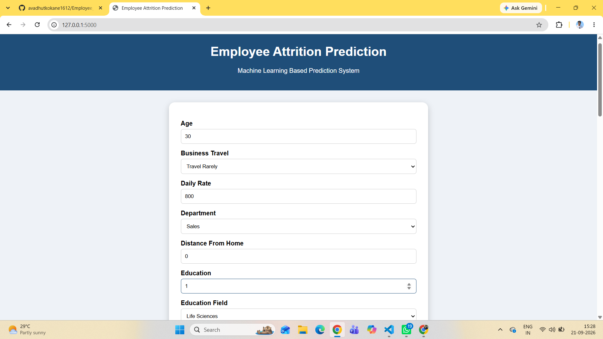
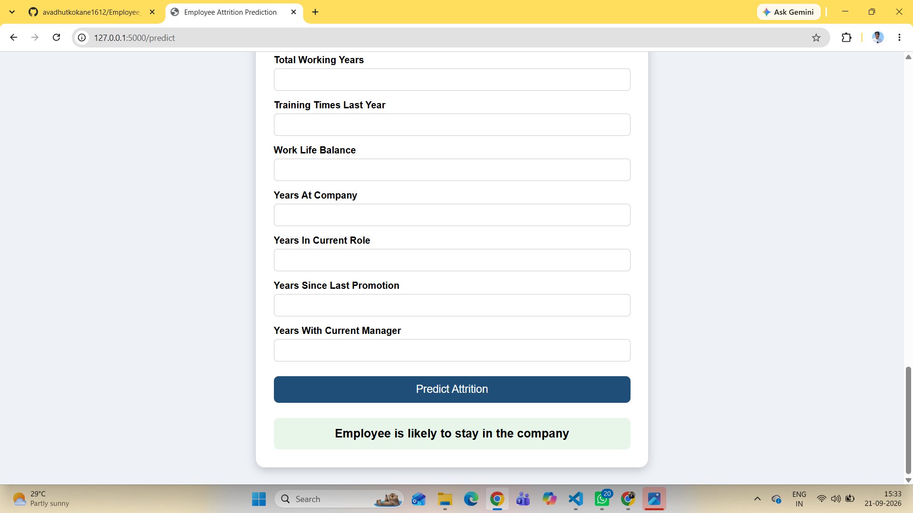
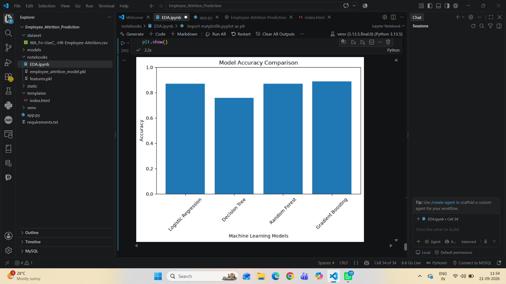
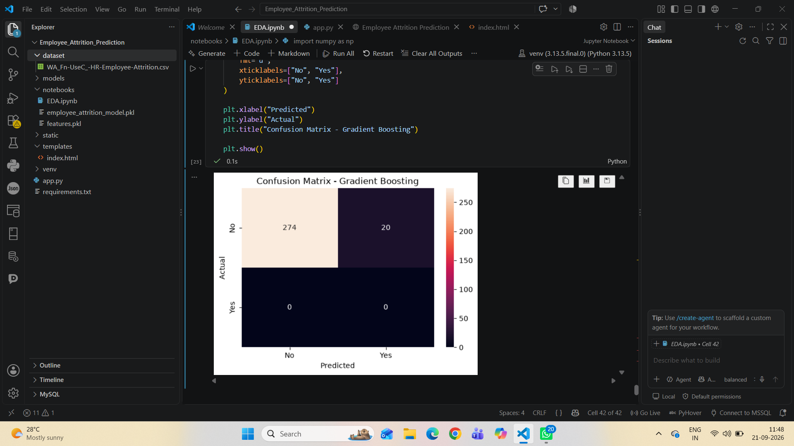

# Employee Attrition Prediction System

## Project Overview

Employee Attrition Prediction is a Machine Learning based system that predicts whether an employee is likely to leave or stay in the company.

The project uses employee data, preprocessing techniques, and machine learning algorithms to identify factors affecting employee attrition.

## Technologies Used

- Python
- Pandas
- NumPy
- Scikit-learn
- Matplotlib
- Seaborn
- Flask
- HTML/CSS

## Machine Learning Models Used

1. Logistic Regression
2. Decision Tree Classifier
3. Random Forest Classifier
4. Gradient Boosting Classifier

## Best Model

Gradient Boosting Classifier achieved the highest accuracy:

Accuracy: 88.78%

## Project Workflow

1. Data Collection
2. Data Cleaning
3. Exploratory Data Analysis
4. Data Preprocessing
5. Feature Encoding
6. Model Training
7. Model Evaluation
8. Flask Web Application Deployment

## Features

- Employee details input form
- Machine learning based prediction
- User friendly web interface
- Attrition prediction result

## Project Structure

Employee_Attrition_Prediction

## Screenshots

### Home Page

### Prediction Result

### Model Accuracy Comparison

### Confusion Matrix

### Feature Importance
